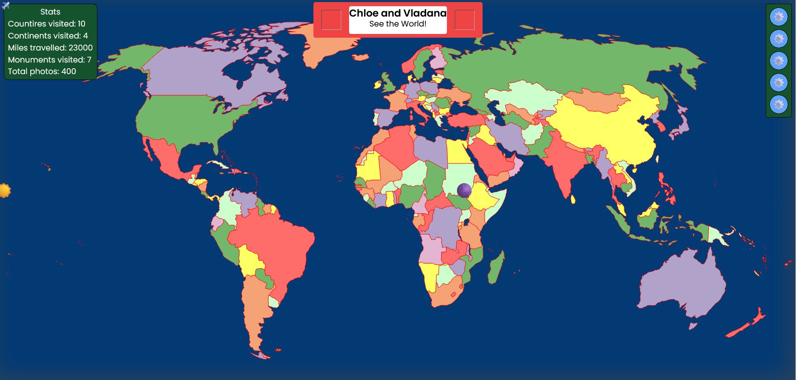

# Project World

## Table of Contents

- [Project World](#project-world)
  - [Table of Contents](#table-of-contents)
  - [General Info](#general-info)
  - [Features](#features)
  - [Technologies](#technologies)
  - [Setup](#setup)
    - [Setup](#setup-1)
  - [Running the Project](#running-the-project)
  - [API Endpoints](#api-endpoints)
    - [User Authentication](#user-authentication)
    - [Countries](#countries)
    - [Media Profiles](#media-profiles)
    - [Slideshows and Posters](#slideshows-and-posters)
  - [Testing](#testing)
    - [API Tests](#api-tests)
    - [Manual Tests](#manual-tests)

## General Info

**Project World** is an interactive map application where users can add data and images to the countries they have visited. The application scans users' media profiles and matches any photos with country hashtags to the respective countries on their map. This feature reduces the need to upload numerous pictures manually. Additionally, the application compiles memory slideshows and posters to advertise countries the user has not yet visited.

## Features

- **Interactive World Map**: Add data and images to countries you've visited.
- **Media Profile Scanning**: Automatically match photos with country hashtags to countries on the map.
- **Memory Slideshows**: Compile slideshows of memories from visited countries.
- **Advertising Posters**: Create posters to advertise countries you haven't visited yet.

## Technologies

**Frontend**:

- React
- JavaScript
- Tailwind CSS
- Axios

**Backend**:

- Node.js
- Express
- MongoDB
- Passport (for authentication)

## Setup

### Setup

1. Clone the repository:

`git clone https://github.com/webdesignsbytom/project_world.git`

## Running the Project

Ensure both the frontend and backend are set up and running as per the setup instructions.
Access the application by navigating to [http://localhost:3000](http://localhost:3000) in your web browser.

## API Endpoints

### User Authentication

- `POST /api/auth/register`: Register a new user.
- `POST /api/auth/login`: Login an existing user.

### Countries

- `GET /api/countries`: Get all countries.
- `POST /api/countries`: Add data and images to a country.
- `GET /api/countries/:id`: Get a specific country.
- `PUT /api/countries/:id`: Update data and images of a specific country.
- `DELETE /api/countries/:id`: Delete a specific country.

### Media Profiles

- `POST /api/media-profiles`: Add a media profile for scanning.
- `GET /api/media-profiles/:id`: Get a specific media profile.
- `PUT /api/media-profiles/:id`: Update a specific media profile.
- `DELETE /api/media-profiles/:id`: Delete a specific media profile.

### Slideshows and Posters

- `GET /api/slideshows`: Get all memory slideshows.
- `POST /api/slideshows`: Create a memory slideshow.
- `GET /api/posters`: Get all advertising posters.
- `POST /api/posters`: Create an advertising poster.

## Testing

### API Tests

Use Postman or Insomnia to test the API endpoints. Check the backend directory for test scripts.

### Manual Tests

Manually test each feature by navigating through the application and verifying the expected behavior of the interactive map, media profile scanning, memory slideshows, and advertising posters.
